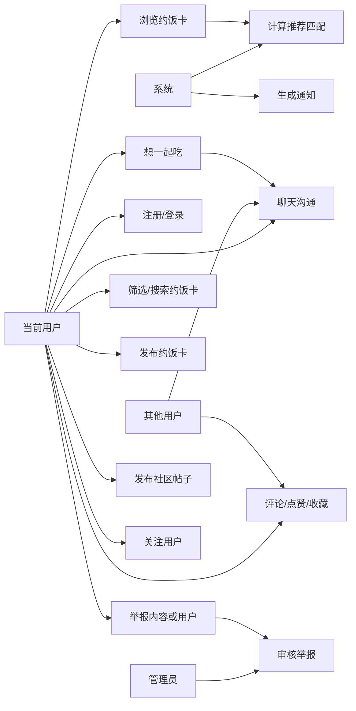
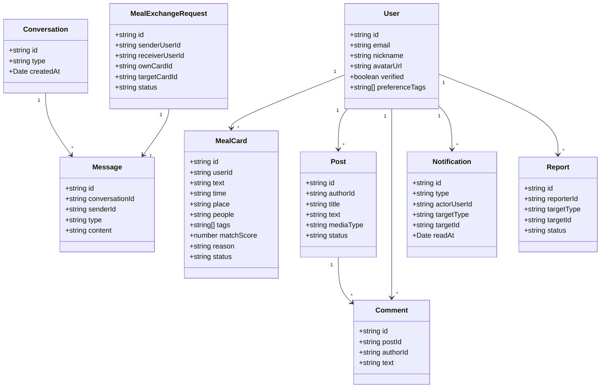
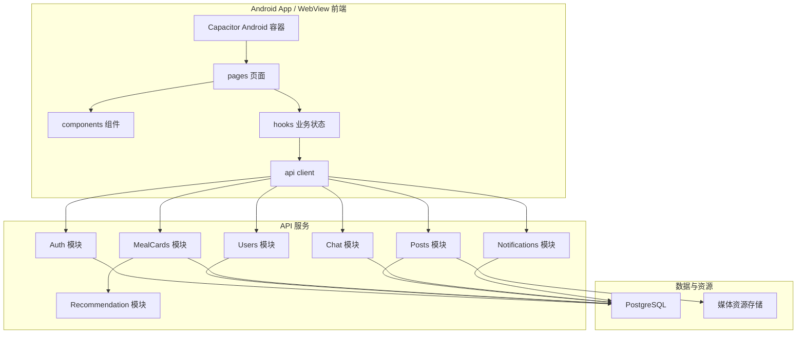
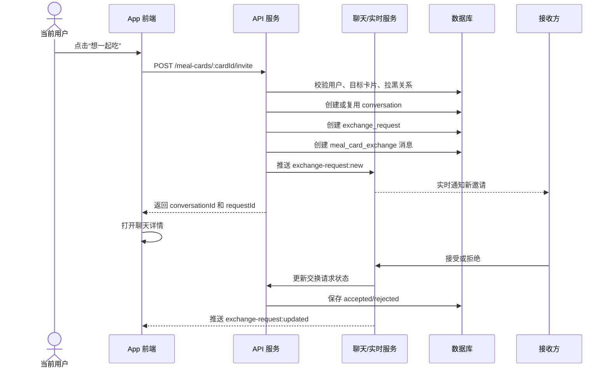
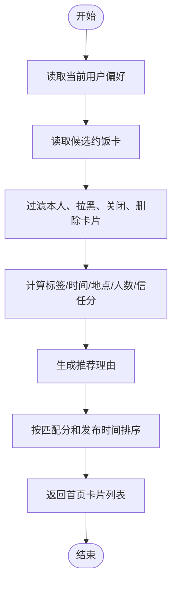
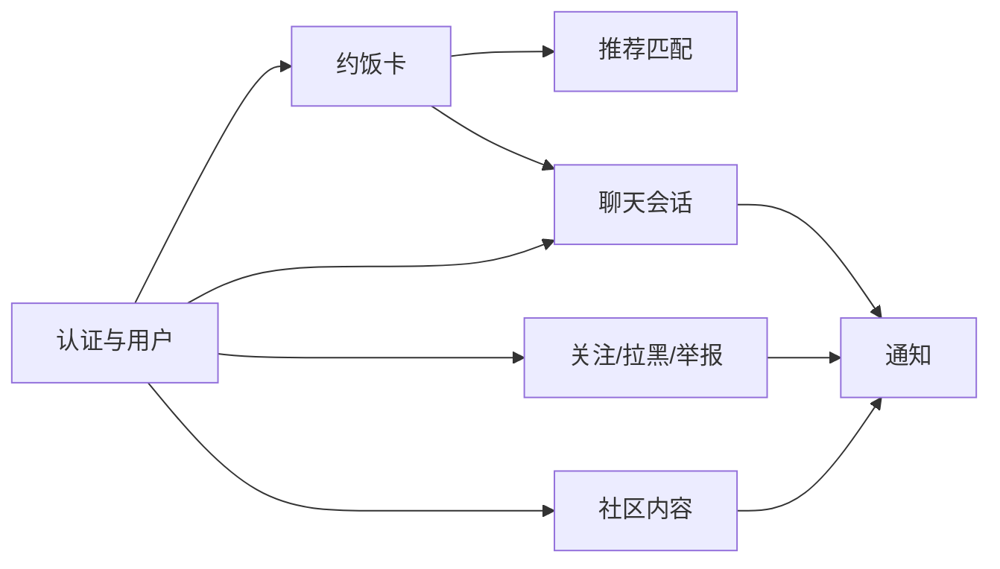
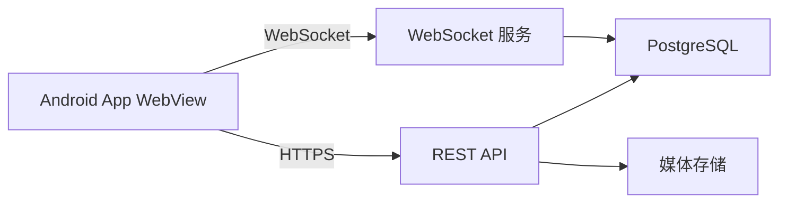
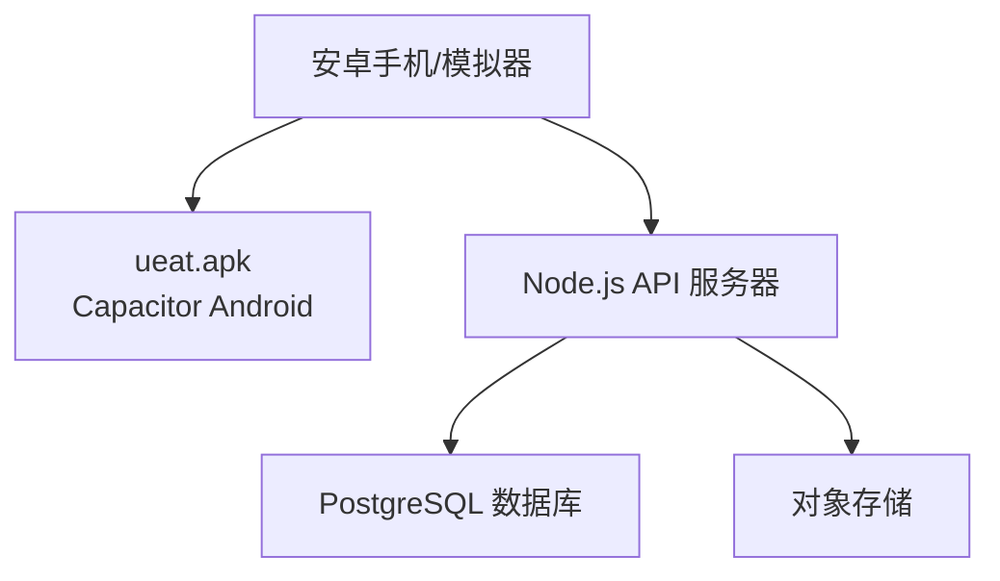
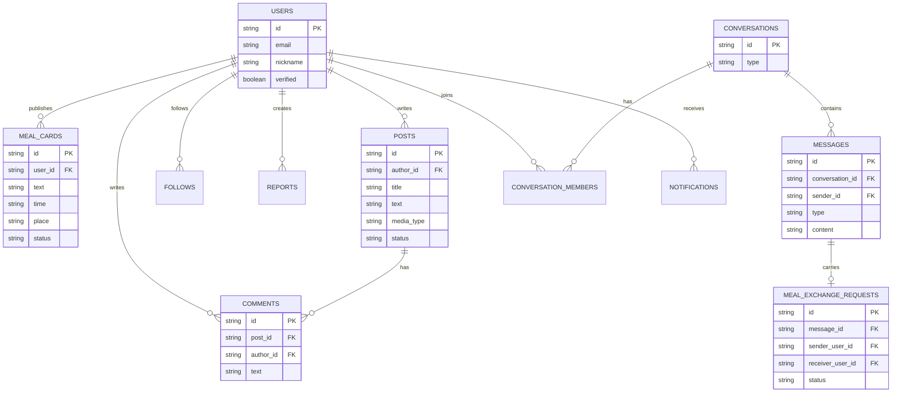

# ueat UML 与架构视图草案

本文档用于第二周技术原型评审材料。后续可将 Mermaid 图导出为图片，放入 Word 或 PPT。

## 1. 用例模型

### 1.1 核心参与者

- 当前用户：注册登录、浏览约饭卡、发布约饭卡、发帖、聊天、管理个人资料。
- 其他用户：被浏览、被关注、接收约饭邀请、参与聊天。
- 管理员：处理举报、审核内容。
- 系统：推荐约饭卡、生成通知、同步聊天消息。

### 1.2 用例图

## 2. 分析模型

### 2.1 领域对象

核心领域对象：

- User：用户账号与资料。
- MealCard：约饭卡。
- Post：社区帖子。
- Comment：评论。
- Follow：关注关系。
- Block：拉黑关系。
- Report：举报记录。
- Conversation：聊天会话。
- Message：聊天消息。
- MealExchangeRequest：约饭卡交换请求。
- Notification：通知。

### 2.2 领域类图

## 3. 设计模型

### 3.1 前后端模块设计

### 3.2 “想一起吃”时序图

### 3.3 约饭卡推荐活动图

## 4. 架构视图

### 4.1 逻辑视图

### 4.2 进程视图

### 4.3 部署视图

## 5. 数据库 ER 草案

## 6. 可直接放入评审 PPT 的结论

- ueat 技术原型采用 Android App 容器 + 前后端分离 + 分层架构，避免把真实业务请求散落在页面组件里。
- 当前界面原型的 hooks 边界可以作为迁移 API 的承接点。
- 核心技术验证包括推荐匹配算法、约饭卡交换消息、REST API、WebSocket 实时同步。
- MVP 不引入复杂微服务，先保证用户、内容、聊天、举报等主链路可运行。
- Capacitor 让当前 React/Vite 移动端前端可以打包为 APK，同时为后续其他客户端保留统一领域模型和接口边界。
