# ueat 原型页面跳转与 Use Case

本文档记录当前 Web 原型的页面/浮层跳转。现在大部分数据来自本地 state 和 mock 数据；后续迁移到 Taro、小程序、App 或接后端时，应把这些跳转改成动态路由、接口数据和消息事件。

## 当前入口

- 底部导航：`首页`、`社区`、`发卡片`、`消息`、`我的`
- 全局搜索：从首页/社区打开，搜索用户、约饭卡片、帖子
- 设置：从“我的”页右上角打开
- 详情浮层：用户主页、约饭卡片详情、帖子详情
- 聊天详情：从消息列表点击会话，或从首页点击“想一起吃”自动进入
- 消息底部导航：无论之前是否自动进入聊天详情，点击底部“消息”都回到消息列表
- 发卡片头像选择：创建约饭卡时可选择卡片头像，发布后写入卡片数据
- 设置二级页：设置列表项在设置页内部切换详情，不进入底部导航页面

## Use Case 总图

图例：

- 实线：主流程跳转或用户主动进入。
- 虚线：返回、关闭浮层、或保留上下文的回退。
- `Overlay`：当前是浮层，不是真正页面路由。
- `Future Route`：迁移后建议变成动态路由或导航参数。

```mermaid
flowchart TB
  User["用户"]

  subgraph BottomNav["底部主导航"]
    Home["首页 Home"]
    Community["社区 Community"]
    CreateCard["发卡片 CreateCard"]
    ChatList["消息列表 Chat"]
    Profile["我的 Profile"]
  end

  User --> Home
  User --> Community
  User --> CreateCard
  User --> ChatList
  User --> Profile

  subgraph HomeFlow["首页约饭卡流程"]
    HomeSearchBtn["点搜索"]
    TagFilter["多选标签筛选\n全部=清空筛选"]
    SwipeCards["左滑上一张/右滑下一张\n下层卡片浮起覆盖"]
    Invite["点想一起吃"]
    AutoOwnCard["系统准备我的约饭卡\n已发布卡片优先/否则自动生成"]
    ExchangeRequest["生成 MealExchangeRequest\nstatus=pending"]
    AutoChat["自动进入对应聊天详情\nautoOpenRequestId"]
  end

  Home --> HomeSearchBtn
  Home --> TagFilter
  Home --> SwipeCards
  Home --> Invite
  Home --> CreateCard
  Invite --> AutoOwnCard --> ExchangeRequest --> AutoChat --> ChatDetail

  subgraph CreateFlow["发布约饭卡流程"]
    CardPreview["卡片预览"]
    CardAvatar["选择卡片头像"]
    CardFields["填写昵称/文案/时间/地点/人数"]
    CardTags["选择或创建标签"]
    CardVisibility["选择可见范围\n同校/关注/匹配推荐"]
    CardDraft["保存草稿"]
    SubmitCard["发布约饭卡"]
    SaveCard["插入 cards state\n更新 tagOptions/publishedCardId"]
  end

  CreateCard --> CardPreview
  CardPreview --> CardAvatar
  CreateCard --> CardFields
  CreateCard --> CardTags
  CreateCard --> CardVisibility
  CreateCard --> CardDraft
  CreateCard --> SubmitCard --> SaveCard -.发布后返回.-> Home
  CreateCard -.取消.-> Home

  subgraph GlobalSearch["全局搜索 Overlay\n从首页/社区打开"]
    SearchOverlay["SearchOverlay\n用户/约饭卡片/帖子"]
    SearchUser["点用户结果"]
    SearchCard["点约饭卡片结果"]
    SearchPost["点帖子结果"]
  end

  HomeSearchBtn --> SearchOverlay
  CommunitySearchBtn["社区点搜索"] --> SearchOverlay
  Community --> CommunitySearchBtn
  SearchOverlay --> SearchUser
  SearchOverlay --> SearchCard
  SearchOverlay --> SearchPost

  subgraph DetailOverlay["统一详情 Overlay\nContentDetailOverlay"]
    UserDetail["用户主页详情\nFuture Route: /users/:userId"]
    FollowUser["关注用户\n非本人主页显示"]
    UserActions["私信/发起约饭/屏蔽/举报"]
    CardDetail["约饭卡详情\nFuture Route: /cards/:cardId"]
    SearchPostDetail["搜索帖子轻量详情\nFuture Route: /posts/:postId"]
    UserPostList["用户发布的帖子列表"]
    UserCardList["用户发布的约饭卡列表"]
    SearchPhoto["搜索帖子照片大图"]
    SearchComment["搜索帖子评论区预览"]
  end

  SearchUser --> UserDetail
  SearchCard --> CardDetail
  SearchPost --> SearchPostDetail
  UserDetail --> FollowUser
  UserDetail --> UserActions
  UserDetail --> UserPostList --> SearchPostDetail
  UserDetail --> UserCardList --> CardDetail
  SearchPostDetail --> SearchPhoto
  SearchPostDetail --> SearchComment
  FollowUser --> FollowedUser
  FollowUser --> NewFollowNotice
  UserDetail -.关闭详情: 回到搜索.-> SearchOverlay
  CardDetail -.关闭详情: 回到搜索.-> SearchOverlay
  SearchPostDetail -.关闭详情: 回到搜索.-> SearchOverlay
  SearchOverlay -.关闭搜索: 回到来源页.-> Home
  SearchOverlay -.关闭搜索: 回到来源页.-> Community

  subgraph CommunityFlow["社区流程"]
    ChannelTabs["切换频道\n推荐/关注/附近/餐厅/生活/经验"]
    OpenPost["点帖子卡片"]
    ComposeChoice["点 + 发布帖子\n选择文字/相册/拍照"]
    ComposeEditor["编辑标题/正文/地点/话题/媒体"]
    ComposeVisibility["选择帖子可见范围\n公开/仅关注/仅同校"]
    ComposeDraft["保存草稿"]
    SubmitPost["发布帖子"]
    SavePost["插入 posts state"]
    CommunityPostDetail["社区完整帖子详情\n含点赞/收藏/评论/媒体"]
    AuthorAvatar["点帖子作者头像"]
    PhotoLightbox["照片大图"]
    VideoDetail["沉浸式视频详情\n无 LIVE/Explore 标签"]
    CommentsSheet["评论 Sheet\n发评论/喜欢/收藏/举报"]
  end

  Community --> ChannelTabs
  Community --> OpenPost --> CommunityPostDetail
  Community --> ComposeChoice --> ComposeEditor --> ComposeVisibility
  ComposeEditor --> ComposeDraft
  ComposeEditor --> SubmitPost --> SavePost --> CommunityPostDetail
  CommunityPostDetail --> AuthorAvatar --> UserDetail
  CommunityPostDetail --> PhotoLightbox
  CommunityPostDetail --> VideoDetail
  CommunityPostDetail --> CommentsSheet
  PhotoLightbox -.关闭.-> CommunityPostDetail
  CommentsSheet -.关闭.-> CommunityPostDetail
  CommunityPostDetail -.关闭详情.-> Community

  subgraph ChatFlow["消息与交换卡片流程"]
    ChatDetail["聊天详情"]
    MessageSearch["消息页内部搜索\n联系人/群聊/聊天记录"]
    LikeNotice["赞和收藏入口"]
    NewFollowNotice["新增关注入口\n右上角数量"]
    CommentMentionNotice["评论和@入口"]
    LikeNoticeList["赞/收藏列表\n谁点赞了哪个帖子"]
    FollowNoticeList["新增关注列表\n可点用户主页"]
    CommentMentionList["评论/@列表\n可点相关帖子评论区"]
    ExchangeBubble["系统交换卡片消息\n展示我的约饭卡"]
    OpenExchangeCard["点交换卡片\n查看卡片详情"]
    Reject["拒绝\n不好意思下次哦"]
    Accept["聊聊看"]
    ExchangeDone["双方可见结果\naccepted/rejected"]
  end

  ChatList --> ChatDetail
  ChatList --> MessageSearch
  ChatList --> LikeNotice --> LikeNoticeList --> SearchPostDetail
  ChatList --> NewFollowNotice --> FollowNoticeList --> UserDetail
  ChatList --> CommentMentionNotice --> CommentMentionList --> SearchPostDetail
  MessageSearch -.取消.-> ChatList
  ChatDetail --> ExchangeBubble
  ExchangeBubble --> OpenExchangeCard --> CardDetail
  ExchangeBubble --> Reject --> ExchangeDone
  ExchangeBubble --> Accept --> ExchangeDone
  ChatDetail -.左上返回.-> ChatList
  ChatDetail -.点底部消息导航\nlistResetSignal.-> ChatList
  AutoChat -.仅新请求自动打开一次.-> ChatDetail

  subgraph ProfileFlow["我的与设置流程"]
    AvatarView["点头像\n查看/更换头像"]
    EditTags["编辑我的偏好标签\n选择/创建标签"]
    MyPost["我发布的帖子"]
    MyCard["最近创作的划卡"]
    MyComment["我发布/喜欢/收藏的评论"]
    LikedPost["喜欢/收藏的帖子"]
    FollowedUser["关注用户"]
    Settings["设置 SettingsPage"]
    SettingDetail["设置项详情\n账号/通用/通知/隐私/帮助/关于/切换/退出"]
    SettingAction["设置项操作面板\n查看状态/继续配置"]
  end

  Profile --> AvatarView
  Profile --> EditTags
  Profile --> MyPost --> SearchPostDetail
  Profile --> MyCard --> CardDetail
  Profile --> MyComment --> SearchPostDetail
  Profile --> LikedPost --> SearchPostDetail
  Profile --> FollowedUser --> UserDetail
  Profile --> Settings --> SettingDetail
  SettingDetail --> SettingAction
  AvatarView -.关闭.-> Profile
  EditTags -.保存/关闭.-> Profile
  SettingDetail -.返回设置列表.-> Settings
  Settings -.返回.-> Profile
```

## 迁移用跳转规则

| 场景 | 当前原型跳转 | 迁移后建议 |
| --- | --- | --- |
| 底部首页/社区/发卡片/消息/我的 | `currentPage` 切换 | Tab route |
| 点底部消息 | 清空 `autoOpenRequestId`，增加 `chatListResetSignal`，显示消息列表 | `/messages`，不带会话参数 |
| 首页点想一起吃 | 生成 `MealExchangeRequest`，设置 `autoOpenRequestId`，进入聊天详情 | POST request 后跳 `/messages/:conversationId?requestId=...` |
| 聊天详情返回 | `setActiveConversation(null)` | 导航栈返回 `/messages` |
| 首页/社区搜索 | 打开全局 `SearchOverlay` | 搜索页或 modal route |
| 搜索结果点用户/卡片/帖子 | 设置 `DetailTarget` 打开详情浮层，搜索仍保留 | modal route 或详情页压栈 |
| 用户主页点关注 | 写入 `followedUsers`，同步我的关注列表与消息新增关注 | POST `/users/:id/follow` 后刷新关注关系和通知 |
| 用户主页点发布的帖子/卡片 | 在详情浮层内切换 `DetailTarget` | 路由压栈到 `/posts/:id` 或 `/cards/:id` |
| 搜索详情关闭 | 关闭详情，回到搜索浮层 | 返回上一层 modal |
| 社区点帖子 | 打开社区内部完整帖子详情 | `/posts/:postId` |
| 社区帖子作者头像 | 打开用户主页详情浮层 | `/users/:userId` |
| 社区发布帖子 | 插入本地 state，立即打开新帖详情 | POST 成功后跳 `/posts/:postId` |
| 消息赞和收藏 | 打开通知列表，点列表项进帖子详情 | `/notifications/likes`，列表项跳 `/posts/:id` |
| 消息新增关注 | 打开新增关注列表，点列表项进用户主页 | `/notifications/follows`，列表项跳 `/users/:id` |
| 消息评论和@ | 打开评论/@列表，点列表项进帖子评论区 | `/notifications/comments`，列表项跳 `/posts/:id?comments=1` |
| 我的页点内容 | 打开用户/卡片/帖子详情浮层 | 动态详情页 |
| 设置列表项 | `SettingsPage` 内部 selected key 切换 | `/settings/:section` 或保留单页状态 |

## 当前实现与后续动态化

| 功能 | 当前原型实现 | 后续正式实现建议 |
| --- | --- | --- |
| 页面导航 | `App.tsx` 用 `currentPage` 做本地页面切换 | 小程序/Taro 用页面路由；App 用导航栈 |
| 搜索结果详情 | `DetailTarget` 打开 `ContentDetailOverlay` | 动态路由 `/users/:id`、`/cards/:id`、`/posts/:id` |
| 搜索返回 | 详情浮层叠在搜索浮层上，关闭详情后仍回搜索 | 使用路由栈或 modal route 保留搜索上下文 |
| 搜索里的帖子详情 | 搜索/我的/消息/社区都使用共享 `PostDetailView` 展示帖子详情 | 正式实现应改为 `PostDetailPage` 动态路由，由来源决定返回栈 |
| 发布约饭卡 | 本地 `cards` state 插入新卡片 | POST `/meal-cards` 后刷新列表或乐观更新 |
| 约饭卡头像 | 创建页保存字符头像到 `MealCard.avatarText` | 上传头像/选择系统头像后保存媒体资源 ID |
| 发布帖子 | 本地 `posts` state 插入新帖子 | POST `/posts` 后进入新帖子详情 |
| 图文/视频帖子 | 社区详情中照片可放大，视频使用沉浸式详情 | 使用媒体 viewer 组件，按 `mediaType` 加载图片/视频资源 |
| 点“想一起吃” | 生成本地 `MealExchangeRequest`，自动进入聊天详情 | 后端生成 request，双方通过聊天消息/实时推送同步 |
| 消息底部导航 | `chatListResetSignal` 强制回消息列表 | 导航到消息首页 route，不携带 conversation param |
| 聊天自动打开 | `autoOpenRequestId` 只针对新交换请求生效一次 | 使用 deep link：`/chat/:conversationId?requestId=...` |
| 消息搜索 | `Chat` 内部本地搜索会话/群聊/记录 | 接消息索引接口或本地 indexed store |
| 我的偏好 | 本地标签 state | 用户偏好接口或 profile store |
| 头像 | 本地字符头像 | 文件上传/媒体资源 ID |
| 设置详情 | `SettingsPage` 内部用 selected key 切换详情 | 设置可继续保留单页状态，或拆为 `/settings/:section` |

## 跳转与代码定位

后续让其他 AI 迁移或接后端时，可以按下面顺序读代码，能比较快地还原跳转链路：

| 要理解的跳转 | 先读 | 再读 | 数据/类型来源 |
| --- | --- | --- | --- |
| 底部导航与全局详情 | `src/App.tsx` | `components/BottomNav.tsx`、`components/ContentDetailOverlay.tsx` | `types/navigation.ts` |
| 首页筛选、划卡、想一起吃 | `pages/Home.tsx` | `lib/exchange.ts`、`pages/Chat.tsx` | `data/meal.ts`、`types/meal.ts`、`types/exchange.ts` |
| 发布约饭卡 | `pages/CreateCard.tsx` | `src/App.tsx` 的 `handleCreateCard` | `types/meal.ts`、`lib/collections.ts` |
| 搜索到用户/卡片/帖子 | `components/SearchOverlay.tsx` | `components/ContentDetailOverlay.tsx` | `types/navigation.ts`、`types/user.ts` |
| 社区发帖、帖子详情、作者主页 | `pages/Community.tsx` | `components/post/PostDetailView.tsx`、`src/App.tsx` 的详情回调 | `data/community.ts` |
| 消息列表、通知、聊天详情 | `pages/Chat.tsx` | `components/chat/ConversationList.tsx`、`components/chat/ChatDetail.tsx`、`components/chat/MealExchangeBubble.tsx`、`components/chat/NotificationPanel.tsx`、`components/chat/MessageSearch.tsx` | `data/chat.ts`、`types/exchange.ts`、`types/notification.ts` |
| 我的页头像、偏好、关注、内容入口 | `pages/Profile.tsx` | `components/profile/ProfileHeader.tsx`、`components/profile/PreferenceTagEditor.tsx`、`components/profile/ProfileSection.tsx`、`components/ContentDetailOverlay.tsx` | `types/user.ts`、`types/meal.ts` |
| 设置首页和二级设置 | `pages/Settings.tsx` | `data/settings.ts` | `data/settings.ts` |

迁移原则：

- 页面文件优先当成“交互和渲染层”理解。
- `data/*` 是原型数据或配置，将来可以替换成接口返回。
- `types/*` 是跨页面契约，迁移时优先保留并补充 ID 字段。
- `lib/*` 是业务规则或通用工具，适合迁到 service 层。
- `App.tsx` 目前承担页面编排，业务 state 已下沉到 `hooks/*`；迁移时优先替换 hooks 内部为 service/store。

## 维护批注

- `App.tsx` 已拆出 `useMealCards`、`useCommunityState`、`useGlobalDetail`、`useExchangeRequests`。后续接后端时优先替换这些 hooks 内部。
- `ContentDetailOverlay` 是为了快速验证搜索/我的页详情跳转，不等价于正式详情页；其中帖子详情已经使用共享 `PostDetailView`。
- `Chat` 里的 `autoOpenRequestId` 和 `listResetSignal` 是原型导航意图。相关说明已移动到 `useExchangeRequests.ts` 和 `pages/Chat.tsx` 文件头，迁移时替换成导航参数。
- 当前 mock 用户仍有昵称匹配，例如 `林同学`。类型层已预留 `userId/authorId`，相关代码已写 TODO；正式数据必须完成替换，避免重名导致详情或聊天匹配错误。
- 搜索详情和社区详情已经合并到 `components/post/PostDetailView.tsx`；后续迁移时把它升级为 `PostDetailPage` 动态路由。
- 现有图像/视频是 CSS 视觉占位，不是真实媒体文件。`data/community.ts` 和 `Community.tsx` 已标注 `TODO(media)`，正式接入时需要统一媒体资源模型和加载状态。
- 通知列表当前仍由本地数据拼装，但已新增 `types/notification.ts` 作为正式 notification 模型草案。
