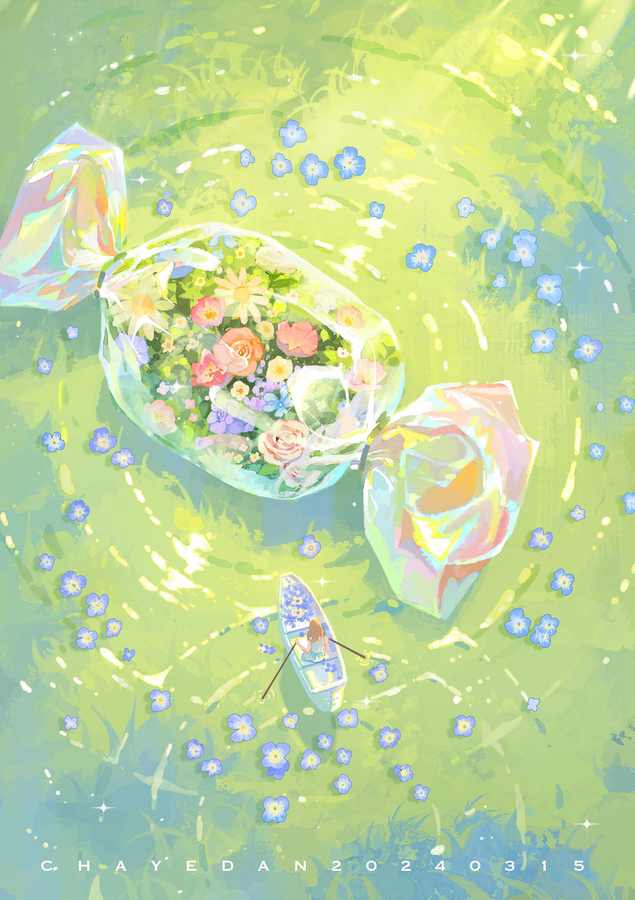
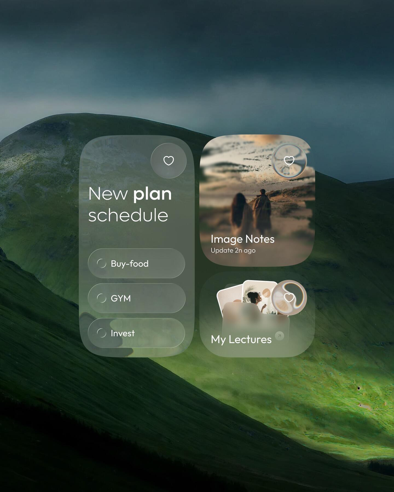

# 10 UI 设计参考

## 参考资料

本项目后续 UI 设计以以下五个小红书笔记为视觉参考，但不直接照搬单一配色、圆角或页面结构：

- [ui笔记.pdf](./ui-reference/xiaohongshu-five-notes/ui笔记.pdf)：14 页稳定阅读版，包含五个笔记的完整图文。
- [ui笔记.docx](./ui-reference/xiaohongshu-five-notes/ui笔记.docx)：可编辑原稿。
- [原始配图目录](./ui-reference/xiaohongshu-five-notes/)：按笔记和出现顺序重命名的 11 张原图。
- [雾林深绿色卡](./ui-reference/xiaohongshu-five-notes/palette-misty-forest.png)：深绿到灰薄荷的主层级参考。
- [薄荷绿色卡](./ui-reference/xiaohongshu-five-notes/palette-mint-green.png)：当前交互色和浅表面颜色锚点。
- [雨林灰绿色卡](./ui-reference/xiaohongshu-five-notes/palette-rainy-forest.png)：暖灰、灰绿和最深文字色参考。
- [绿色苹果色卡](./ui-reference/xiaohongshu-five-notes/palette-green-apple.jpg)：历史参考；其中偏黄的梨色和高饱和黄绿不再进入当前运行时主题。
- [绿色花湖背景](./ui-reference/xiaohongshu-five-notes/green-flower-lake-background.jpg)：保留为配色与氛围参考，不再作为运行时页面背景。
- [绿色重点综合色卡](./ui-reference/xiaohongshu-five-notes/palette-collection-green-focus.jpg)：仅用于确认绿色区域与其他候选色卡的关系，不再把粉、紫、蓝分组铺满界面。
- 春日水面、樱花、虹彩棱镜与扩展四季色卡保留为历史参考，不再作为当前运行时主题。

### 当前色彩锚点

| 角色 | 原图颜色 | 使用范围 |
| --- | --- | --- |
| Jungle Green | `#182718` | 主文字、深色页面底和最高对比层；取自原图标注 RGB `24,39,24` |
| Kombu Green | `#324A36` | 次级深色文字、深色标签和暖灰绿页面中的结构色 |
| Forest Ink | `#2D584B` | 深色交互、图标和选中态文字 |
| 主操作绿 | `#448870` | 主按钮、导航强调、关键链接和确认操作 |
| Misty Green | `#6F9D87` | 次级强调、图表或内容占位中的中深层级 |
| Mint Green | `#87C1AA` | 在线状态、标签、头像占位和轻量选中态 |
| Soft Mint | `#B4DBCA` | 交互底色、卡片反射和玻璃环境色 |
| Frost Mint | `#DAEDE4` | 页面表面、输入区域和浅层雾化底色 |
| Laurel Grey | `#B9BB9F` | 暖灰绿提示、第五档标签和聊天系统消息 |
| Pastel Grey | `#E0DBD0` | 暖灰表面、搜索建议和低优先级状态提示 |
| 语义红 | `#DD4350` | 未读、危险操作、必须立即识别的状态 |

普通状态标签与小面积信息块以 `#DAEDE4`、`#B4DBCA`、`#87C1AA`、`#6F9D87` 及其透明变体为主。唯一例外是“我的偏好”：允许使用粉、珊瑚、蜜黄、薄荷、天青、浅蓝、淡紫七种低饱和纯色循环，但不使用渐变，也不把七彩扩散到页面背景、主按钮或导航。个人名片不使用装饰性渐变；头像占位使用纯色 Soft Mint。

聊天详情继续保留暖白氛围，但系统消息与提示改用 `#E0DBD0`、`#B9BB9F`，发送气泡使用薄荷绿，不再使用淡黄色。

### 背景使用边界

运行时主页面不使用装饰背景图。首页、饭卡详情、社区、消息列表、我的、发卡片、设置、搜索和通知统一使用浅绿霜白实色环境；透明材质只用于表达导航、输入栏、弹窗和重点面板的层级。参考图继续保存在项目中，供未来提取颜色与构图关系，但不能直接铺到页面底层。

### 最高优先级参考

`note-1-primary.jpg` 是当前最高优先级视觉参考。核心不是把界面涂成绿色，而是组合以下关系：

- 深青绿、墨绿和低饱和蓝灰构成远景，暖绿色局部光负责聚焦。
- 真实山体、雾和环境光提供空间感，UI 像置于环境之上，而不是浮在纯色背景上。
- 前景毛玻璃保留背景色和明暗变化，同时用足够的雾化与描边保证文字可读。
- 白色文字和线性图标形成清晰对比，强调色保持少量，不使用黄绿并列铺满页面。

## 图片对应关系

| 笔记 | 图片 | 主要视觉特征 |
| --- | --- | --- |
| 笔记一 | `note-1-primary.jpg`、`note-1-01.jpg` - `note-1-04.jpg` | 深青绿环境、真实媒介背景、克制的玻璃层、注意力管理 |
| 笔记二 | `note-2-01.jpg` | 紫粉风景、低饱和半透明悬浮面板、轻量数据层级 |
| 笔记三 | `note-3-01.jpg` | 冰蓝底色、乳白半透明卡片、少量高饱和数据强调色 |
| 笔记四 | `note-4-01.jpg` - `note-4-03.jpg` | 暖粉棕环境、白色大标题、深浅玻璃层与底部圆形导航 |
| 笔记五 | `note-5-01.jpg` | 真实天气大图、深色电影感、少量玻璃信息面板 |

## 设计结论

这些参考的共同点不是某一种颜色，而是通过背景环境、材质透明度、文字对比和空间层级管理注意力。U eat 应采用以下原则：

1. 内容优先。帖子、图片、对话和用户信息必须比装饰更醒目，不能为了玻璃效果降低可读性。
2. 材质有层级。普通内容保持清晰、安静；毛玻璃用于导航、抽屉、弹窗、悬浮工具栏和少量重点面板。
3. 色彩按页面语境变化。全局使用森林绿、薄荷绿和灰绿色卡；聊天详情保留独立的暖灰绿色语境。
4. 真实图片只服务内容。帖子媒体、头像和用户上传封面可以使用图片；主页面不铺装饰背景图，也不使用无意义的装饰色块或模糊光球。
5. 层级来自对比。通过字号、字重、留白、透明度和前后景关系建立层级，避免堆叠卡片和过量阴影。
6. 组件规则稳定。沿用现有紧凑圆角体系；普通卡片圆角不超过 8px，圆形图标按钮、系统 Sheet 和已有特殊组件除外。
7. 图标统一使用现有 Lucide 线性图标，按钮优先使用熟悉符号并提供 tooltip 或无障碍名称。

## 毛玻璃规则

- 毛玻璃必须有可解释的背景内容。没有环境图或下层内容时，使用普通半透明表面，不为模糊而模糊。
- Web 可从 `backdrop-filter: blur(16px)` 到 `blur(24px)` 起步，并配合半透明底色、1px 低对比描边和轻微阴影。
- 深色环境使用偏冷的黑青或墨绿透明底；浅色环境使用带少量环境色的乳白底，避免纯白玻璃脱离背景。
- 同一视图最多使用两到三个明确材质层级，不能让每个列表项都成为独立玻璃卡片。
- 正文、输入框和关键按钮必须达到可读对比。背景过于复杂时，先提高雾化和底色不透明度，再考虑文字阴影。
- 不支持 `backdrop-filter`、低性能设备或减少透明效果场景下，回退为接近最终混色结果的实色表面。
- 模糊区域应尽量稳定，避免在滚动长列表中给每一项持续计算大面积背景模糊。

## 页面方向

- 首页与饭卡详情：共用浅绿霜白实色背景；两处饭卡结构、透明度、描边和阴影保持一致，并避免循环浮动动画。
- 社区：使用薄荷绿、灰绿和霜白组织状态层级；帖子真实媒体不加统一滤镜。
- 消息列表：跟随全局绿色色卡和霜白表面，不使用整页黄色主题。
- 聊天详情：使用暖白纹理背景、白色接收气泡、薄荷绿发送气泡和暖灰系统消息；图片和语音消息不加重滤镜。
- 用户主页：使用深绿、薄荷绿、灰绿和霜白建立资料层级；名片不使用装饰渐变，头像、封面和关系状态仍是第一视觉焦点。
- 搜索与通知：强调扫描效率和未读状态；红点只表达未读，不承担装饰用途。
- 弹窗与抽屉：优先使用有实色回退的毛玻璃材质，让背景仍能说明当前所在页面和空间层级。

## 动效与手势

动效遵循 Apple 风格的即时反馈、连续空间和可中断性：

- 按压反馈应在 100ms 内出现。图标按钮优先使用轻微缩放、明暗或材质变化；扩散高光只作为克制的辅助反馈。
- 列表首次进入可分批带入，但单项间隔要短，不能延迟用户点击；长列表只给首屏做节奏处理。
- Tab 指示条与内容同步滑动，内容切换采用短距离推进或交叉淡化，不让旧内容突然消失。
- 页面层级切换可采用右侧推入、上一层轻微左移；返回手势必须能跟手、反向取消并从当前位置继续。
- Sheet 和抽屉按拖拽速度与距离决定吸附点，松手使用阻尼弹簧；动画进行中仍允许再次拖拽或关闭。
- 骨架屏使用低对比高光扫过，加载完成后交叉淡化；已有内容刷新时尽量保留旧内容，避免整页闪烁。
- 状态变化优先在同一组件内平滑过渡。撤回、已读、正在输入、关注状态等不能引发布局跳动。
- 图表只在首次可见时做一次短促生长，并同步显示数值；数据更新不重复播放完整入场动画。
- 所有非必要动画必须响应 `prefers-reduced-motion: reduce`：取消视差、扫光和大位移，改用即时状态或短淡化。

## 实施边界

- 本文定义视觉与动效方向，不替代 [04-interaction-spec.md](./04-interaction-spec.md) 中的业务行为。
- 不重写已有页面和数据流程，优先通过设计 token、共享样式和小范围组件调整逐步落地。
- 每轮 UI 修改都要同时检查桌面和移动视口、键盘操作、触控热区、文本溢出、对比度和减少动态效果模式。
- 参考图中的大圆角、强模糊和高透明度不能直接照搬；先满足 U eat 的信息密度、性能和可读性。
## 偏好数据边界

“我的偏好”只来自注册完善资料和用户在个人页手动编辑，不能从系统标签池、饭卡标签、默认推荐标签或历史创建饭卡自动填充。MBTI 是注册完善资料里的可选偏好项，保存为 `MBTI INFP` 这类普通偏好标签，并允许用户后续在个人页删除或修改。
