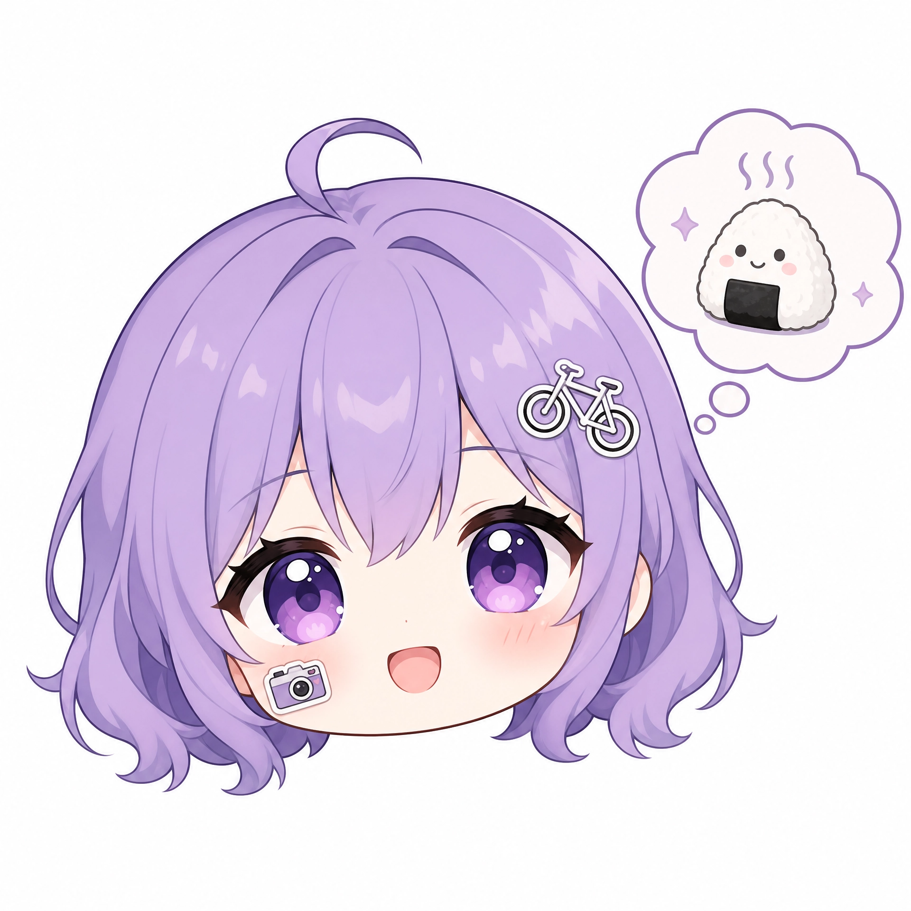

# 桌宠功能说明

本文档同步 `web/src/components/pet`、`web/src/hooks/usePetCompanion.ts`、`web/src/services/petApi.ts` 与后端 `/users/me/pet` 的当前实现，说明 Ueat 桌宠的入口、状态、交互、素材来源和后续限制。

## 功能定位

桌宠是 Ueat 的轻量陪伴与活跃度反馈系统。它不是独立游戏，而是全局悬浮在主应用页面上的互动角色：

- 用户投喂、喝水、发约饭卡、发帖、评论、点赞、收藏、转发、聊天、加入群聊等行为会奖励经验、饱食、心情和亲密度。
- 桌宠通过 PNG 帧动画和台词反馈用户行为，也会根据所在页面说不同话。
- 当前使用 VPet 项目的部分 PNG 帧作为课程原型素材；正式上线或商用前应替换为 Ueat 自有或完整授权素材。

## 双桌宠款式路线（规划）

后续桌宠可拆成两款可选形象，共享同一套账号级状态、台词、投喂和成长数据，但视觉表现复杂度不同：

### A 款：动态陪伴桌宠

这是当前已实现的桌宠方向，重点是“活着的小人”：

- 保留逐帧 PNG 动作：待机、投喂、喝水、摸头、思考、睡觉、捏/拎起、收边探头、走路、爬行、下落、爬墙等。
- 适合继续扩展衣柜系统，例如帽子、发型、衣服、手持物、表情特效。
- 如果要保证换装自然，长期推荐使用“官方完整皮肤包”或“分层/骨骼化素材”；短期可用锚点配饰，但歪头、跳动、爬墙时会有轻微不贴合。
- 适合保留完整桌宠面板和移动按钮，也适合作为未来 AI 媒介的主形象。

### B 款：静态 Q 版头像桌宠

这是另一款更轻量、更容易个性化的形象路线。它可以保留语音、投喂、喝水、亲密度、状态面板和页面感知台词，但删除或弱化复杂逐帧动作：

- 默认形象是统一或少量差异化的 Q 版大头头像，例如发色、瞳色、肤色、背景框不同。
- 用户兴趣标签可以映射成贴纸：摄影显示相机贴纸，骑行显示自行车贴纸，音乐显示音符贴纸，探店显示餐具/地图贴纸。
- 贴纸可提供系统默认位置，也允许用户在装扮页拖动、缩放、旋转，保存为账号级配置。
- 交互动效不需要逐帧素材：摸头时上下浮动/轻微缩放，投喂时冒爱心或小食物粒子，喝水时冒水滴，思考时出现问号/灯泡。
- 因为它不追求走路、爬墙、下落等复杂动作，所以更适合用户上传头像或低成本定制。
- 兴趣标签贴纸的详细设计、槽位、数据结构和隐私边界见 `18-pet-avatar-tag-sticker-design.md`。

参考风格图如下，仅作为课程原型的视觉方向备忘；正式素材需要使用自绘、授权或可商用素材：




### 两款桌宠的功能差异

| 功能 | A 款动态桌宠 | B 款静态头像桌宠 |
| --- | --- | --- |
| 语音气泡 | 保留 | 保留 |
| 投喂/喝水 | PNG 动作反馈 | 轻量浮动、粒子或表情反馈 |
| 摸头 | PNG 动作反馈 | 上下浮动/缩放反馈 |
| 思考/说话 | PNG 表情动作 | 问号、灯泡、表情贴纸反馈 |
| 睡觉 | PNG 睡觉动作 | 闭眼/睡眠气泡贴纸 |
| 走路/爬行/下落/爬墙 | 保留 | 删除或不展示 |
| 收边探头 | 保留 | 可保留头像半露出效果 |
| 衣柜/装扮 | 皮肤包、锚点配饰或分层素材 | 头像变体、贴纸、边框、背景 |
| 用户上传 | 难以自然支持完整动作 | 更容易支持裁剪头像/贴纸摆放 |

### B 款数据结构建议

未来可以在 `user_pet_states` 的 JSON 中增加款式和装扮配置，不需要另建表即可先跑通原型：

```json
{
  "petStyle": "animated-vpet",
  "avatarPet": {
    "baseId": "q-avatar-default-01",
    "hairColor": "#7c5f8f",
    "eyeColor": "#8b5cf6",
    "stickers": [
      {
        "id": "camera",
        "x": 0.72,
        "y": 0.28,
        "scale": 0.34,
        "rotate": -8
      }
    ]
  }
}
```

其中 `x/y` 建议使用 0–1 的归一化坐标，保证不同屏幕尺寸和桌宠大小下都能还原贴纸位置。

### B 款最小原型状态（2026-07-20）

当前前端已实现 B 款 Q 版头像桌宠的最小原型：

- `PetCompanionState` 增加 `petStyle` 和 `avatarPet`，旧账号 JSON 缺少字段时会自动补默认值。
- `petStyle` 支持 `animated-vpet` 与 `avatar-static`，两款共享等级、经验、饱食、心情、亲密度、位置、本地缓存和 `/users/me/pet` 云同步。
- B 款内置 11 张用户提供的大头照头像素材，位于 `web/public/assets/pet-avatar-avatars/`；当前生成透明底 PNG 版本并默认使用 `avatar-03.png`。旧状态中保存的内置 `.jpg` 路径会在前端规范化时自动迁移到 `.png`。
- 真实图片头像不叠加前端绘制的眨眼覆盖层，避免出现黑色眉毛/眼睛样的闪烁线条；眨眼层只用于无图片 URL 的前端占位头像。
- B 款仍不依赖 Live2D、GPU 后端或 AI 生成模型。
- B 款贴纸从 `web/public/assets/pet-avatar-stickers/stickers-manifest.json` 读取，按 `avatarPet.stickers` 的 0–1 坐标、`scale` 和 `rotate` 叠加透明 PNG；用户上传贴纸通过 `avatarPet.stickers[].src` 保存 URL。
- B 款已保留语音气泡、投喂、喝水、摸头、思考、睡觉/休息提示、收边探头、状态面板和页面感知台词。
- B 款面板隐藏走路、爬行、下落、爬墙等逐帧身体动作入口；来自奖励或旧状态的复杂动作会在头像模式下回落为轻量反馈。
- B 款当前轻动效包括自动眨眼、轻微呼吸浮动、摸头弹跳、投喂粒子、喝水水滴、思考问号、说话轻摆头和睡眠提示。
- 已新增全屏桌宠衣柜页，可从侧边衣服按钮、状态面板“进入衣柜”和“我的页 > 桌宠管家 > 衣柜”进入。
- 衣柜页当前支持 A/B 款选择、B 款大头照头像变体、透明底头像/贴纸上传、右侧贴纸栏拖拽添加、画布内贴纸拖动位置和四角把手缩放。
- 上传头像或贴纸只接受带 alpha 的 PNG/WebP；前端会先检查透明像素，非透明底图片不会上传。上传后的头像 URL 保存到 `avatarPet.customAvatarUrl`，上传贴纸 URL 保存到 `avatarPet.stickers[].src`。
- 桌宠状态新增 `petIntro`，主人可在“我的页 > 桌宠管家”编辑 50 字以内公开介绍。别人点击公开桌宠时，介绍以气泡形式展示约 8 秒。
- 已新增公开桌宠摘要：别人主页和私聊详情会读取对方 `visible=true` 的桌宠形象、等级、心情和介绍；不会暴露饱食、亲密度、daily、屏幕位置等完整私有状态。
- 贴纸旋转手柄、贴纸公开确认、上传内容审核和商城/付费装扮仍是后续工作。

## 当前入口

- 登录并完成资料后，`App.tsx` 全局挂载桌宠。
- “我的”页仍保留桌宠管家入口，用于重新显示、投喂、打开衣柜和查看基础状态。
- 桌宠默认使用最小尺寸 `sm`，当前 `sm` 展示宽度为 92px；位置和状态会保存在本地，并在登录账号下同步到云端。
- 当前可从桌宠侧边衣服按钮进入全屏衣柜页，再选择 A 款动态桌宠或 B 款 Q 版头像桌宠；状态面板中也保留快速切换和“进入衣柜”按钮。

## 交互规则

### 小人本体

- 拖动小人本体可以移动桌宠。
- 轻触小人本体触发摸头动作与随机摸头台词，不打开状态面板。
- 长按或拖动时触发捏/拎起动作；松开后根据拖动方向触发下落反馈。
- 如果拖动松手时手指/指针基本触碰到屏幕左右边缘，才触发收边探头。
- 从收边探头状态触碰或拖动小人时，判定更宽松：会先把桌宠恢复到桌面内，避免用户想拎回来却再次收边。
- 桌宠位置会在窗口尺寸变化时夹回可见区域，避免桌面端位置带到手机端后跑出屏幕。

### 收边探头

- 收边后桌宠会保留较明显的探头可点击面积。
- 刚收边后的“点我 / 拖我”提示只显示几秒，之后只保留小人探头，减少视觉打扰。
- 收边状态会隐藏侧边快捷按钮和摸头反馈，但保留点击小人身体打开面板、拖拽小人回到桌面的能力。

### 状态条与面板

- 小人底部的 `Lv / 心情` 状态条用于打开或关闭状态面板。
- 面板支持拖动标题栏移动位置，避免固定遮挡当前页面内容。
- 面板打开后，桌宠本体和状态条层级高于面板；如果两者重叠，优先显示桌宠。
- 面板包含经验、饱食、心情、亲密度、尺寸切换、喝水、思考、睡觉、爬墙、停止爬墙、说话表情、移动预览和“回到桌面”按钮。

### 侧边快捷按钮

- 侧边快捷按钮包含投喂、衣柜预留入口、收起为小球和显隐开关。
- 桌宠在屏幕左半边时，快捷按钮在桌宠左侧；桌宠在屏幕右半边时，快捷按钮在桌宠右侧，减少遮挡中间内容。
- 点击显隐开关后，三个快捷按钮隐藏；隐藏状态只保留一个小眼睛按钮在桌宠正下方，用于恢复显示。

### 小球形态

- 点击 `-` 后，桌宠收缩为浅黄色圆形小球。
- 点击小球可恢复正常桌宠。
- 小球也可以拖动。

## 动作与台词

当前动作注册在 `web/src/components/pet/vpetFrames.ts`，桌宠 UI 通过 `FramePlayer` 播放 PNG 帧。

已接入的主要动作：

- 基础：`idle`、`sleep`、`levelUp`
- 投喂/喝水：`eatNormal`、`eatHappy`、`drink`
- 互动：`touchHead`、`think`、`pinch`、`raise`
- 说话：`saySelf`、`saySerious`、`sayShy`
- 收边：`sideHideLeft`、`sideHideRight`
- 移动预览：`walkLeft/right`、`crawlLeft/right`、`fallLeft/right`、`climbTopLeft/right`
- 爬墙：`climb`、`climbLeft`、`climbRight`

随机台词：

- 摸头、思考、普通说话和活动奖励都会从多条文案中随机选择。
- 页面感知台词按首页、社区、发卡、聊天、我的、设置等页面触发不同表达和动作。
- 聊天页停留较久时会出现轻量冒泡。

## 自动行为

- 自然衰减：桌宠会按离线和在线时间轻微消耗饱食；饱食偏低时心情下降，长期太饿会轻微降低亲密。
- 自动休息：饱食过低时，桌宠会退出爬墙并进入睡觉/趴下状态；投喂后恢复到进食反馈。
- 自动小动作：如果用户约 5 分钟没有与桌宠互动，且桌宠处于空闲、未收边、未爬墙、未睡觉、未被拖拽状态，系统每 1–2 分钟轻量检查一次，低概率触发 `walk/fall/crawl/top` 预览动作和随机“怎么这么久不理我”类台词。
- 自动小动作只持续约 3.2 秒，然后回到 `idle`；触发一次后至少再冷却约 5 分钟，避免持续打扰用户。

## 活跃度投喂

当前通过 `web/src/lib/petActivity.ts` 分发桌宠活跃事件，通过 `web/src/hooks/usePetCompanion.ts` 统一计算奖励和每日上限。

| 行为 | 事件名 | 说明 |
| --- | --- | --- |
| 手动投喂 | `manual_feed` | 点击餐具按钮 |
| 手动喝水 | `manual_drink` | 点击状态面板喝水按钮 |
| 发布约饭卡片 | `meal_card` | 成功发卡片后奖励 |
| 交换/约饭邀请 | `exchange` | 发起约饭邀请后奖励 |
| 发布帖子 | `post` | 成功发社区帖子后奖励 |
| 评论 | `comment` | 成功发表评论后奖励 |
| 点赞 | `like` | 点赞奖励 |
| 收藏 | `favorite` | 收藏奖励 |
| 转发 | `share` | 转发帖子后奖励 |
| 私聊消息 | `message` | 发送文本、图片或语音消息后奖励 |
| 群聊广场 | `group` | 创建或加入公开群聊后奖励 |

每种行为有每日奖励上限，避免无限刷经验。

## 状态与存储

桌宠状态类型定义在 `web/src/hooks/usePetCompanion.ts` 的 `PetCompanionState`，包含：

- 是否显示、是否收缩
- 款式：`petStyle`，当前为 `animated-vpet` / `avatar-static`
- B 款头像配置：`avatarPet`
- 等级、经验、饱食、心情、亲密
- 尺寸：`sm` / `md` / `lg`
- 屏幕位置
- 当前动作
- 爬墙状态：`wallMode`
- 收边状态：`edgeHidden`
- 最近台词和发言时间
- 衰减时间、页面上下文发言时间
- 当日各类奖励次数

本地 key：

```text
ueat-pet-companion-v2:<userId 或 guest>
```

云端同步：

```text
GET /users/me/pet
PATCH /users/me/pet
```

云端表：

```text
user_pet_states
```

当前云端以 JSON 状态整体保存，同一个账号共享一只桌宠，不按设备分别计算。前端保留本地 fallback：云端暂时不可用时仍可本地互动，之后继续尝试同步。

当用户在设置页确认注销账号后，后端会随用户账号一并删除 `user_pet_states` 云端记录，前端也会清掉该账号对应的本地桌宠 fallback 缓存。

## 当前素材来源

第一版桌宠临时使用 VPet 项目的部分内置动画资源，仅用于非商业课程原型验证。

来源：

```text
https://github.com/LorisYounger/VPet
```

本项目复制的 PNG 帧资源位于：

```text
web/public/assets/vpet-prototype/frames/
```

资源说明文件：

```text
web/public/assets/vpet-prototype/NOTICE.md
```

注意：

- VPet 代码许可证和内置图片/动画素材要求不完全相同。
- 当前资源仅用于学校课程原型展示，不作为商业素材包分发。
- 正式上线或商业发布前，应替换为 Ueat 自有素材或确认完整授权。

## 实现文件索引

- `web/src/components/pet/PetCompanion.tsx`：桌宠 UI、拖拽、面板、侧边按钮、收边探头、自动小动作。
- `web/src/components/pet/AvatarPetCompanion.tsx`：B 款 Q 版头像桌宠渲染、眨眼、呼吸浮动和轻互动效。
- `web/src/components/pet/AvatarStickerLayer.tsx`：读取贴纸 manifest，并支持用户上传贴纸 URL，按归一化坐标叠加透明贴纸。
- `web/src/components/pet/PetWardrobePage.tsx`：全屏衣柜页，支持款式、内置大头照头像变体、透明底头像/贴纸上传、右侧贴纸栏拖拽和画布内贴纸直接编辑。
- `web/src/components/pet/PublicPetBadge.tsx`：公开桌宠只读展示卡片，用于别人主页和私聊详情。
- `web/src/components/pet/vpetFrames.ts`：动作名、帧序列、循环配置。
- `web/src/hooks/usePetCompanion.ts`：桌宠状态、奖励规则、自然衰减、本地存储、云同步。
- `web/src/lib/petActivity.ts`：跨页面活跃事件分发。
- `web/src/services/petApi.ts`：账号级桌宠状态读写 API。
- `server/src/modules/users.ts`：提供 `/users/me/pet` 完整状态读写，以及 `/users/:userId/pet-public` 公开摘要读取；保存时限制 `petIntro` 最多 50 字。
- `web/src/App.tsx`：全局挂载桌宠并接入发卡、发帖、评论、点赞等奖励事件。
- `web/src/pages/Profile.tsx`：我的页桌宠管家入口。
- `web/src/components/chat/ChatDetail.tsx`：消息发送奖励。
- `web/src/components/chat/ConversationList.tsx`：群聊广场奖励。
- `server/src/modules/users.ts`：`/users/me/pet` 云同步接口。
- `server/src/data/postgres.ts`：`user_pet_states` 表和读写方法。

## 后续方向

- 替换为 Ueat 官方素材库，并设计发型、服装、配饰、手持物等可组合资源。
- 将衣柜按钮接入正式换装系统，优先支持 A 款动态桌宠的皮肤包/锚点配饰，以及 B 款静态头像桌宠的贴纸、边框和头像变体。
- 增加桌宠款式选择页：用户可以在动态陪伴桌宠和静态 Q 版头像桌宠之间切换，同一账号仍共享等级、亲密度和云端状态。
- B 款静态头像桌宠可先只保留语音、投喂、喝水、摸头、思考、收边探头和状态面板，删除走路、爬行、下落、爬墙等复杂动作入口。
- 云同步目前是 JSON 整体覆盖，未来可做字段级合并或版本冲突处理。
- 未来接入 AI 时，建议让 AI 只输出 `line`、`suggestedReplies`、`emotion`、`action` 等结构化结果，由前端映射到固定动画，避免让模型直接控制任意 UI 行为。
## 2026-07-20 A/B sticker state update

- A style (`animated-vpet`) now supports lightweight transparent stickers in addition to the existing frame animation behavior.
- A style does not support avatar upload or avatar variant selection. In the wardrobe page, selecting A hides the avatar row and keeps the sticker rail/editor visible.
- A and B sticker placements are intentionally independent: A stores placements in `animatedPet.stickers`; B stores placements in `avatarPet.stickers`.
- Both arrays use normalized `x/y`, `scale`, `rotate`, optional `src`, and the same sticker manifest/assets. Uploaded transparent stickers can be reused in the rail without moving them between A and B.
- `PetCompanion.tsx` overlays A stickers on the dynamic frame player. `AvatarPetCompanion.tsx` continues to own B avatar rendering.
- Public pet summaries now include `animatedPet.stickers`, so profile/chat public badges can show A style stickers without exposing the full private pet state.

## 2026-07-20 public pet interaction and naming update

- Pet state now includes `petName`. If the owner has not customized it, public summaries use the account nickname fallback: `<nickname>的桌宠`.
- The owner can edit `petName` in `Profile > Pet Manager`; the same card also exposes feed, drink, wardrobe, show, and hide actions.
- Public pet badges are interactive. A style responds like a pat/head-touch; B style bobs upward. Both open the pet intro bubble for about 8 seconds.
- In direct chat detail, the peer pet is no longer rendered as a message-flow card. It floats near the upper-left of the chat canvas, below the back/navigation header, with the intro bubble on the pet's right.
- On public profile pages, the pet can remain inside a profile card, but the interaction and right-side intro bubble behavior match the chat pet.
