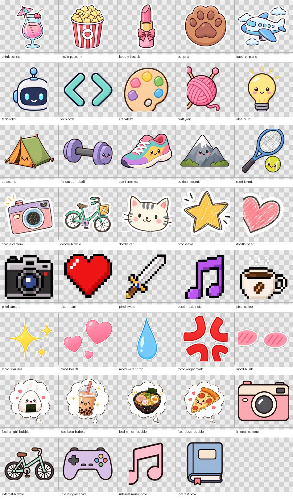

# Q 版头像桌宠兴趣标签贴纸设计

本文档沉淀第二款“静态 Q 版头像桌宠”的兴趣标签贴纸方案。它与 `11-pet-companion.md` 中的 B 款桌宠路线配套，用于把用户兴趣标签、饭搭子画像和个性装扮转化为可视化贴纸。

## 设计目标

- 让用户一眼看出自己的兴趣画像，例如摄影、骑行、美食、音乐、游戏、电影、旅行、运动等。
- 保持 Q 版头像桌宠的轻量实现：不需要逐帧动作，也不需要为每个动作重新制作贴纸帧。
- 保留桌宠核心陪伴功能：语音气泡、投喂、喝水、摸头、思考、亲密度、状态面板和页面感知台词。
- 支持后续装扮页：用户可以选择系统贴纸，也可以微调贴纸的位置、大小和旋转角度。

## 参考资料

原始参考文件已迁移到项目文档素材目录：

- Markdown 方案：`./assets/pet-avatar-style/tag-design-proposal.md`
- Word 方案：`./assets/pet-avatar-style/tag-design-proposal.docx`
- 参考效果图：`./assets/pet-avatar-style/q-avatar-with-tags-reference.png`
- 原始贴纸合集图：`./assets/pet-avatar-style/sticker-sheets/`
- 裁剪预览图：`./assets/pet-avatar-style/sticker-crop-preview.png`

参考效果图如下，仅作为课程原型视觉方向备忘；正式上线需要使用自绘、授权或可商用素材：


当前已把第一批贴纸合集图拆成单个透明 PNG，供后续第二款桌宠原型直接使用：

```text
web/public/assets/pet-avatar-stickers/
```

贴纸清单：

```text
web/public/assets/pet-avatar-stickers/stickers-manifest.json
```

裁剪预览如下，棋盘格仅用于检查透明区域：



## 核心标签设计示例

| 兴趣分类 | 贴纸/元素设计 | 视觉呈现建议 |
| --- | --- | --- |
| 摄影 | 复古小相机 | 放在脸颊一侧，像小纹身或贴纸 |
| 骑行 | 简约自行车或头盔 | 作为发卡固定在头发上 |
| 美食家 | 冒热气的饭团、拉面或奶茶 | 悬浮在嘴角附近的小气泡里 |
| 音乐 | 音符或头戴式耳机 | 音符漂浮，耳机可直接戴在头上 |
| 游戏 | 像素风手柄或小红心 | 贴在额头一角，或作为瞳孔高光变体 |
| 电影 | 胶片、场记板或爆米花桶 | 环绕在头部的半透明装饰带 |
| 旅行 | 纸飞机、小行李箱或地图针 | 像云朵一样漂浮在头顶上方 |
| 运动 | 小火焰、网球、足球或奖牌 | 放在脸颊腮红区域，增加动感 |

## 视觉布局策略

- 脸颊装饰：适合小型扁平图标，例如相机、红心、星星、游戏手柄。
- 发饰替换：适合结构感强的物体，例如自行车、乐器、水果、小帽子。
- 悬浮气泡：适合表达动态偏好或当前心情，例如饭团、火锅、奶茶、问号、灯泡。
- 腮红叠加：适合半透明贴纸，把兴趣图标融进腮红，让风格更柔和。
- 周边环绕：适合电影胶片、星星、音符、纸飞机等轻装饰，避免遮挡脸部表情。

## 贴纸数据结构建议

贴纸位置建议用归一化坐标保存，避免不同屏幕尺寸、桌宠大小和裁剪比例导致位置漂移：

```json
{
  "petStyle": "avatar-static",
  "avatarPet": {
    "baseId": "q-avatar-default-01",
    "hairColor": "#b79af2",
    "eyeColor": "#7c3aed",
    "stickers": [
      {
        "id": "camera",
        "sourceTag": "photography",
        "slot": "cheek-left",
        "x": 0.32,
        "y": 0.72,
        "scale": 0.22,
        "rotate": -8
      },
      {
        "id": "bicycle",
        "sourceTag": "cycling",
        "slot": "hair-right",
        "x": 0.66,
        "y": 0.35,
        "scale": 0.18,
        "rotate": 4
      }
    ]
  }
}
```

字段说明：

- `id`：贴纸素材 ID。
- `sourceTag`：来自用户兴趣标签或算法画像的标签名。
- `slot`：系统推荐槽位，例如 `cheek-left`、`hair-right`、`bubble-top-right`。
- `x/y`：贴纸中心点在头像画布中的 0–1 坐标。
- `scale`：相对头像画布宽度的缩放比例。用户贴纸编辑时可以通过双指缩放、滑杆或角标拖拽调整大小。
- `rotate`：旋转角度，单位为度。
- `src`：可选字段，仅用于用户上传贴纸；保存透明 PNG/WebP 上传后的媒体 URL，内置贴纸仍优先通过 manifest 的 `id` 解析。

## 当前贴纸资产拆分

第一批裁剪后共有 39 个独立 PNG，均放在 `web/public/assets/pet-avatar-stickers/` 下，并通过 `stickers-manifest.json` 暴露给前端：

| 分类目录 | 数量 | 内容 |
| --- | ---: | --- |
| `lifestyle-social` | 5 | 鸡尾酒、爆米花、口红、爪印、飞机 |
| `tech-art` | 5 | 机器人、代码括号、调色盘、毛线球、灯泡 |
| `outdoor-sports` | 5 | 帐篷、哑铃、运动鞋、山、网球 |
| `doodle-style` | 5 | 手绘相机、自行车、猫、星星、爱心 |
| `pixel-art` | 5 | 像素相机、爱心、剑、音符、咖啡 |
| `mood-decor` | 5 | 闪光、爱心组、水滴、生气符号、腮红 |
| `food-bubbles` | 4 | 饭团、奶茶、拉面、披萨想法气泡 |
| `interest-stickers` | 5 | 相机、自行车、手柄、音符、书 |

透明背景说明：

- 对第二款静态头像桌宠来说，透明 PNG 是最方便的格式，可以直接叠在头像上，不需要再做背景遮罩。
- 用户上传头像和贴纸也必须是带 alpha 通道的透明 PNG/WebP；前端上传前会抽样读取像素 alpha，非透明底图片会被拒绝，不会进入上传流程。
- 用户调整贴纸大小不是靠重新生成图片，而是前端渲染时改变 `scale`；位置和大小保存到 `user_pet_states` 的 JSON 即可。
- 原图里多个贴纸挤在同一张图上，已经裁剪成“一张 PNG 一个图标贴纸”。如果后续发现某个贴纸边缘仍有残留或过紧，可以只替换对应 PNG，不影响 manifest 结构。

## 与现有标签体系的关系

- 用户显式选择的偏好标签可以优先转为贴纸。
- 饭卡、帖子、评论和聊天中抽取的兴趣标签可以作为候选贴纸，但默认不自动公开展示，避免过度暴露用户隐私。
- 当标签过多时，桌宠只展示 2–4 个主贴纸，其余进入装扮页候选列表。
- 与 `17-semantic-taxonomy-governance-and-auto-update.md` 的语义标签治理保持一致：贴纸展示应使用审核后的稳定标签，不直接展示模型临时推断结果。

## 一期实现建议

1. 在衣柜入口新增“桌宠款式”选择：动态桌宠 / Q 版头像桌宠。
2. 为 Q 版头像桌宠提供 3–6 个官方基础头像变体。
3. 为 8 个核心兴趣分类提供官方贴纸素材。
4. 根据用户偏好标签自动选择最多 3 个贴纸，并使用系统默认槽位。
5. 保存用户手动调整后的贴纸 `x/y/scale/rotate` 到 `user_pet_states` JSON。

## 当前一期落地状态（2026-07-20）

- 已在桌宠状态中加入 `petStyle` 与 `avatarPet`，并通过现有 `user_pet_states` JSON 本地保存和云同步。
- 已新增 B 款 `avatar-static` 渲染：默认 Q 版头像使用前端 2.5D 结构，`hairColor/eyeColor/eyeAnchors` 可从状态读取。
- 已新增 `AvatarStickerLayer`，运行时读取 `web/public/assets/pet-avatar-stickers/stickers-manifest.json`，根据 `avatarPet.stickers` 叠加透明 PNG；用户上传贴纸可通过 `avatarPet.stickers[].src` 恢复显示。
- 当前贴纸资产清单包含 39 张透明 PNG，衣柜右侧贴纸栏会全部展示；头像画布上仍建议同时保留 2–4 张，避免头像拥挤。
- 已支持从侧边衣服按钮、桌宠面板和我的页桌宠管家进入全屏桌宠衣柜页；用户可在衣柜页选择 A/B 款。
- 衣柜页已接入 11 张用户提供的大头照作为 B 款内置头像变体，资源位于 `web/public/assets/pet-avatar-avatars/`，并提供透明底 PNG 版本用于桌宠显示。
- 衣柜页已改为画布式贴纸编辑：右侧贴纸栏提供贴纸，用户可拖拽贴纸到画布；画布上的贴纸可直接拖动位置，选中后用四角把手缩放。
- 衣柜页已支持用户上传透明底头像和透明底贴纸；头像上传后写入 `avatarPet.customAvatarUrl`，贴纸上传后写入 `avatarPet.stickers[].src` 并加入右侧栏。
- 所有贴纸位置和大小继续保存为 `x/y/scale/rotate`，用户上传贴纸额外保存 `src`；其中当前画布交互主要更新 `x/y/scale`。
- B 款保留语音气泡、投喂、喝水、摸头、思考、睡眠提示、收边探头和状态面板。
- B 款当前隐藏走路、爬行、下落、爬墙等复杂逐帧入口；交互反馈由眨眼、呼吸浮动、弹跳、粒子、水滴、问号和轻微摆头完成。
- 贴纸旋转手柄仍未开放；当前保留已有 `rotate` 数据结构，不重新生成 PNG。
- 贴纸和头像上传当前只做透明底校验与 URL 保存，暂未提供裁剪、压缩、眼睛锚点校准或内容审核界面。

## 后续风险

- 参考图和网上头像不应直接商用；正式版本需要自绘、授权或使用明确可商用素材。
- 用户上传头像需要裁剪、压缩、内容审核和删除机制。
- 贴纸自动推荐需要隐私边界：用户未确认前，不应把敏感推断标签展示在公开页面。
## 2026-07-20 shared sticker update

- The sticker system now applies to both pet styles, not only the static Q-avatar style.
- A style stores its own placements in `animatedPet.stickers`; B style stores its own placements in `avatarPet.stickers`. They must not be merged or overwritten when switching styles.
- The wardrobe page is mode-aware: A shows the dynamic pet canvas plus the sticker rail/editor, and hides avatar upload/variant controls; B shows avatar controls plus the same sticker editor.
- Sticker assets still come from `public/assets/pet-avatar-stickers/stickers-manifest.json`; user uploaded stickers require transparent PNG/WebP and save `src` on the placement.
- Position and size remain normalized (`x/y/scale/rotate`) so mobile editing and desktop rendering share one data model.
