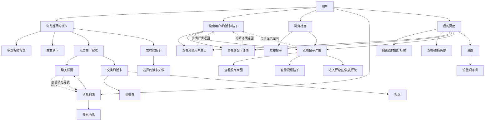

# ueat 原型页面跳转与 Use Case

本文档记录当前 Web 原型的页面/浮层跳转。现在大部分数据来自本地 state 和 mock 数据；后续迁移到 Taro、小程序、App 或接后端时，应把这些跳转改成动态路由、接口数据和消息事件。

## 当前入口

- 底部导航：`首页`、`社区`、`发卡片`、`消息`、`我的`
- 全局搜索：从首页/社区打开，搜索用户、约饭卡片、帖子
- 设置：从“我的”页右上角打开
- 详情浮层：用户主页、约饭卡片详情、帖子详情
- 聊天详情：从消息列表点击会话，或从首页点击“想一起吃”自动进入
- 消息底部导航：无论之前是否自动进入聊天详情，点击底部“消息”都回到消息列表
- 发卡片头像选择：创建约饭卡时可选择卡片头像，发布后写入卡片数据
- 设置二级页：设置列表项在设置页内部切换详情，不进入底部导航页面

## Use Case 图

## 当前实现与后续动态化

| 功能 | 当前原型实现 | 后续正式实现建议 |
| --- | --- | --- |
| 页面导航 | `App.tsx` 用 `currentPage` 做本地页面切换 | 小程序/Taro 用页面路由；App 用导航栈 |
| 搜索结果详情 | `DetailTarget` 打开 `ContentDetailOverlay` | 动态路由 `/users/:id`、`/cards/:id`、`/posts/:id` |
| 搜索返回 | 详情浮层叠在搜索浮层上，关闭详情后仍回搜索 | 使用路由栈或 modal route 保留搜索上下文 |
| 搜索里的帖子详情 | `ContentDetailOverlay` 展示轻量详情；社区列表点开使用 `Community` 内完整帖子详情 | 正式实现应统一到同一个 `PostDetailPage`，由来源决定返回栈 |
| 发布约饭卡 | 本地 `cards` state 插入新卡片 | POST `/meal-cards` 后刷新列表或乐观更新 |
| 约饭卡头像 | 创建页保存字符头像到 `MealCard.avatarText` | 上传头像/选择系统头像后保存媒体资源 ID |
| 发布帖子 | 本地 `posts` state 插入新帖子 | POST `/posts` 后进入新帖子详情 |
| 图文/视频帖子 | 社区详情中照片可放大，视频使用沉浸式详情 | 使用媒体 viewer 组件，按 `mediaType` 加载图片/视频资源 |
| 点“想一起吃” | 生成本地 `MealExchangeRequest`，自动进入聊天详情 | 后端生成 request，双方通过聊天消息/实时推送同步 |
| 消息底部导航 | `chatListResetSignal` 强制回消息列表 | 导航到消息首页 route，不携带 conversation param |
| 聊天自动打开 | `autoOpenRequestId` 只针对新交换请求生效一次 | 使用 deep link：`/chat/:conversationId?requestId=...` |
| 消息搜索 | `Chat` 内部本地搜索会话/群聊/记录 | 接消息索引接口或本地 indexed store |
| 我的偏好 | 本地标签 state | 用户偏好接口或 profile store |
| 头像 | 本地字符头像 | 文件上传/媒体资源 ID |
| 设置详情 | `SettingsPage` 内部用 selected key 切换详情 | 设置可继续保留单页状态，或拆为 `/settings/:section` |

## 维护批注

- `App.tsx` 目前是原型总控层，集中放了跨页面 state。功能稳定后，应拆成 `stores/`、`services/`、`routes/`。
- `ContentDetailOverlay` 是为了快速验证详情跳转，不等价于正式详情页。后续可拆成独立页面：`UserProfilePage`、`MealCardDetailPage`、`PostDetailPage`。
- `Chat` 里的 `autoOpenRequestId` 和 `listResetSignal` 是原型导航意图。它们不是业务字段，迁移时应替换成导航参数。
- 当前 mock 用户用昵称匹配，例如 `林同学`。正式数据必须使用稳定 `userId`，避免重名导致详情或聊天匹配错误。
- 当前搜索详情和社区详情存在两套帖子展示：前者偏轻量，后者含点赞、收藏、评论和媒体沉浸视图。后续应合并为一个详情页面组件。
- 现有图像/视频是 CSS 视觉占位，不是真实媒体文件。正式接入时需要统一媒体资源模型和加载状态。
